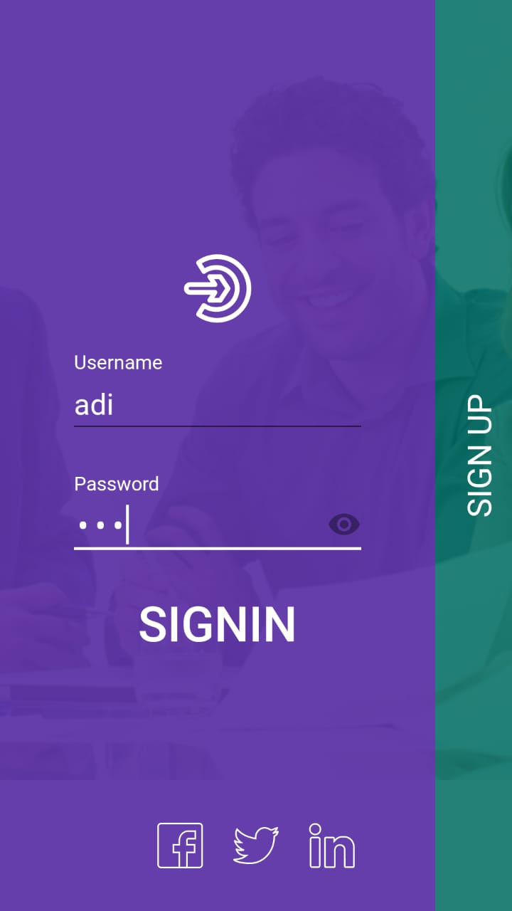
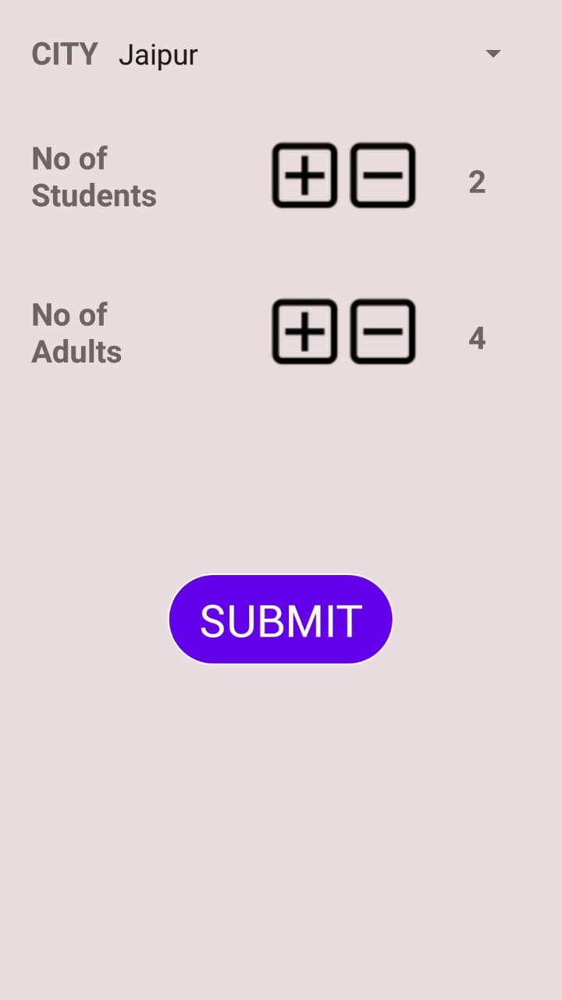
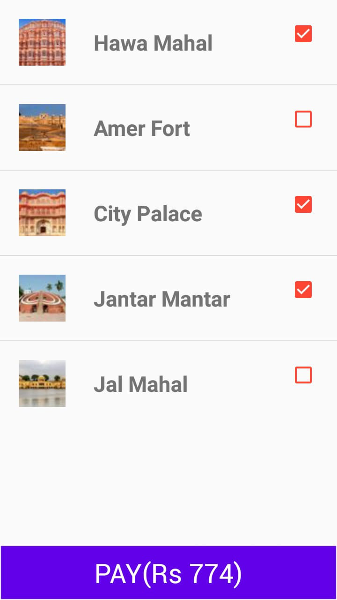
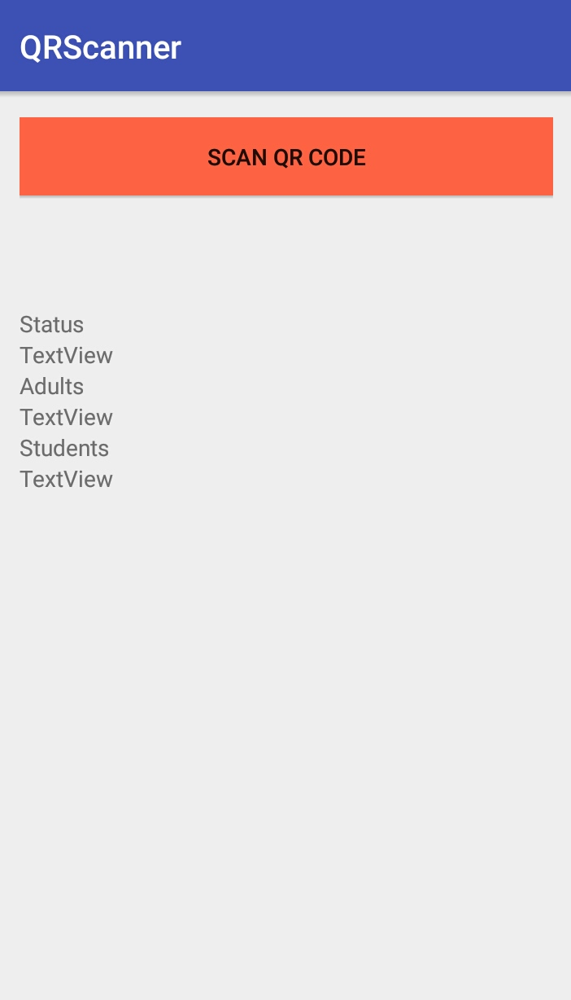
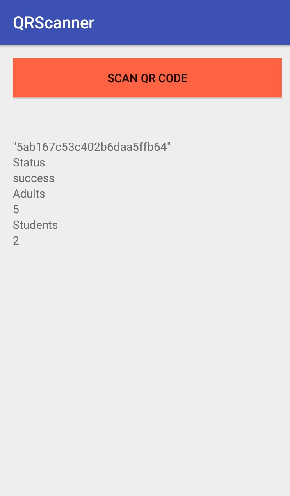

TourMitra Android App
===================================

This app implements a service for tourists visiting a city to easily book a ticket for all the attractions they plan to
visit quickly at the same time. It eliminates the need for tourists to buy tickets separately at all the venues.
It also eliminates the need for human presence for ticket validation at the entry points of venues using a unique QR
code which is generated for each ticket.

There are 2 versions of the app - one for tourists and one for the venue managers.
The tourist version enables the user to make an account and then proceed to book the ticket.
The venue version allows them to verify the ticket and allow entry accordingly.
The app connects to MongoDB hosted at a remote server which stores all the data.

Pre-requisites
--------------

- Android SDK v26
- Android Build Tools v26.0.0
- Android Support Repository
- MongoDB

Screenshots
-------------

       

Getting Started
---------------

This sample uses the Gradle build system. To build this project, use the
"gradle build" command or use "Import Project" in Android Studio.

Support
-------

- Google+ Community: https://plus.google.com/communities/105153134372062985968
- Stack Overflow: http://stackoverflow.com/questions/tagged/android
